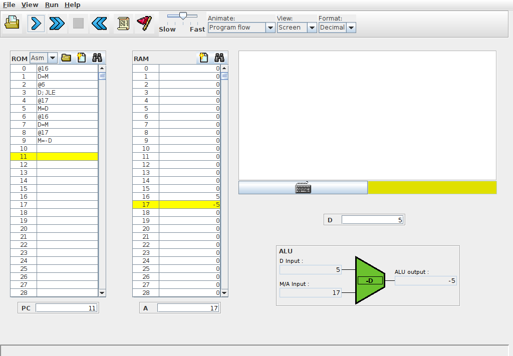
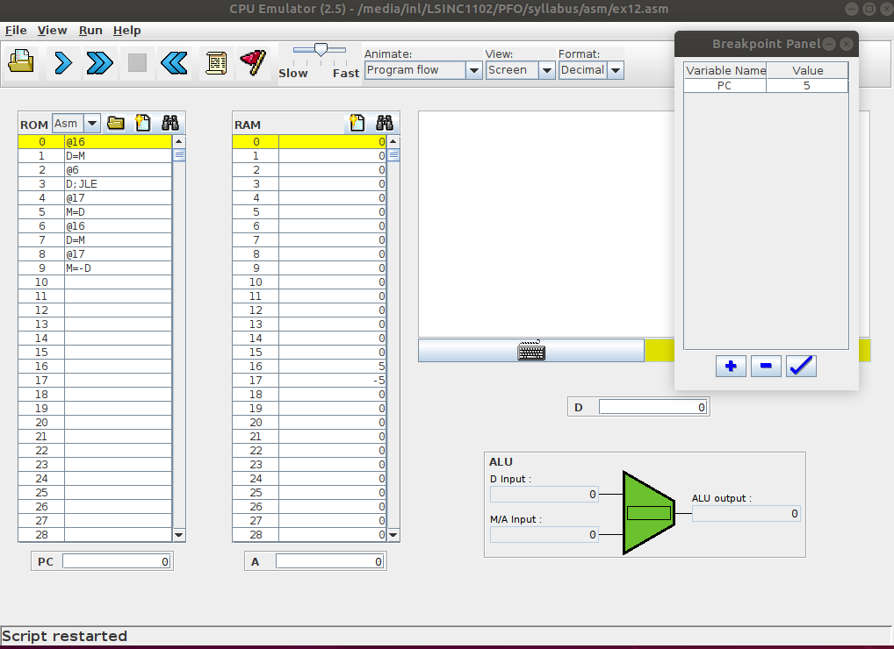

.. LSINC1102 documentation master file, created by
   sphinx-quickstart on Tue Jan 28 18:06:33 2020.
   You can adapt this file completely to your liking, but it should at least
   contain the root `toctree` directive.

Tests de programmes en langage d'assemblage
===========================================

Le langage d'assemblage est un langage de très bas niveau car il manipule directement la mémoire et les registres du minuscule processeur. Même si il ne supporte que deux types d'instructions, il est suffisamment expressif pour permettre des logiciels complexes. Tout comme pour les langages de programmation de plus haut niveau comme python, il est très important de bien tester et de vérifier le bon fonctionnement des programmes écrits en langage d'assemblage.

Pour ces tests, le livre de référence propose un simulateur du minuscule processeur qui peut s'utiliser de deux façons :

 - exécution pas à pas d'un programme via l'interface graphique
 - exécution "en batch" d'un programme et d'une suite de tests qui y est associée

L'exécution pas à pas est très pratique pour bien comprendre le fonctionnement d'un programme en langage d'assemblage ou détecter des erreurs durant son développement. L'interface graphique (:numref:`fig-cpu-sim`) du simulateur est assez intuitive.

.. _fig-cpu-sim:

	    
   Simulateur interactif du minuscule processeur	    

Le menu ``File`` permet de charger un programme en langage d'assemblage. Celui-ci peut avoir été écrit avec un éditeur de texte ou être du code machine qui a été produit par l'assembleur fourni avec le livre. Lorsque le simulateur du minuscule CPU charge un programme en langage d'assemblage, il vérifie d'abord sa syntaxe et affiche un message d'erreur en rouge en cas de problème. Ces messages d'erreur ne sont pas toujours explicites. Quand un tel message apparaît, il peut être utile de charger le programme dans l'assembleur de façon à vérifier sa syntaxe et le corriger si nécessaire.

Le programme chargé apparaît dans le tableau de gauche qui représente la ROM du minuscule ordinateur. Il est possible de modifier les instructions se trouvant dans ce tableau, mais pas de sauver la ROM modifiée dans un fichier. La mémoire RAM contenant les données est représentée par le second tableau. La partie droite de la fenêtre du simulateur représente l'écran graphique et le clavier.

Les trois registres du minuscule ordinateur sont représentés par des boites. La première est le ``PC`` qui se trouve en bas à gauche. Le registre ``A`` qui contient l'adresse en RAM à laquelle il faut lire les données se trouve en dessous de la RAM. Enfin, la partie droite de la fenêtre représente l'ALU avec le contenu du registre ``D`` juste au-dessus.

Il est possible d'exécuter un programme en minuscule langage d'assemblage de trois façons différentes. La première est l'exécution pas à pas. En cliquant sur la flèche bleue simple, on simule un cycle d'horloge et donc l'exécution d'une instruction. Cela permet d'observer l'exécution de petits programmes et l'effet de chaque instruction sur les différents registres et la mémoire. Cette exécution pas à pas reste fastidieuse pour de grands programmes.

.. spelling::

   breakpoints

La seconde méthode pour exécuter un programme est de définir des conditions d'arrêt ( :index:`breakpoints` en anglais). Ces conditions permettent de spécifier quand l'exécution du programme doit s'arrêter. Ces conditions peuvent être :

 - une valeur du ``PC``
 - un nombre de cycles d'horloge
 - une valeur particulière dans le registre ``A`` ou le registre ``D``
 - une valeur stockée à une adresse en mémoire (cela permet de prendre en compte les valeurs des variables stockées en mémoire)

Grâce à ces conditions, il est possible de lancer l'exécution d'un programme et de passer au mode pas à pas dans la région du code qui est la plus intéressante. Plusieurs conditions d'arrêt peuvent être définies. Le simulateur les évalue lorsqu'il exécute chaque instruction et s'arrête dès qu'une condition est vérifiée.
   
.. _fig-cpu-sim-break:

   Breakpoints avec le simulateur interactif du minuscule processeur	    

La troisième méthode et d'écrire un script qui contrôle l'exécution du simulateur. Ces scripts sont un extension de ceux que vous avez déjà utilisé pour les circuits logiques. Ils permettent d'initialiser certaines zones de la mémoire et d'analyser le résultat de l'exécution d'un programme. Il est très utile de construire une script de test avant d'écrire un programme en assembleur.

Pour illustrer l'utilisation de ces scripts, reprenons le programme qui permet de calculer la valeur absolue d'un nombre entier. Nous avons vu précédemment que le code repris ci-dessous ne fonctionnait pas correctement

.. literalinclude:: asm/ex12.asm
   :language: console

Ce programme a comme entrée un entier qui est stocké à l'adresse ``16`` (``@x``)en mémoire RAM. La valeur absolue calculée se trouve à l'adresse ``17`` (``@y``). La première étape pour tester un tel programme est de définir les résultats attendus pour chaque exécution du programme. A la fin de chaque exécution, nous devons vérifier les valeurs se trouvant en mémoire aux adresses ``16`` et ``17``. 

.. literalinclude:: asm/abs.cmp
   :language: console
	      
Ce fichier est téléchargeable via :download:`asm/abs.cmp`.
   
Les cinq lignes du fichier ci-dessus correspondent aux différents cas d'utilisation de notre programme de calcul de la valeur absolue. Un programme qui passe ces cinq tests devrait calculer la valeur absolue correctement.

Nous pouvons maintenant écrire notre script de test. Celui-ci contient d'abord une initialisation qui déclare le nom du fichier en langage machine à exécuter (``abs.hack`` dans notre exemple), le fichier de sortie (``abs.out`` dans notre exemple) et le format des données de sortie.

Ensuite, nous pouvons définir chaque test en initialisant le registre ``PC`` à ``0`` et en plaçant les valeurs souhaitées en RAM. La commande ``ticktock`` permet de faire passer un cycle d'horloge et donc d'exécuter une instruction. La commande ``repeat x { ... }`` répète ``x`` fois les instructions se trouvant dans le bloc ``{ ... }``. Enfin, la commande ``ouput`` sauve dans le fichier de sortie les données définies dans la commande ``output-list``. Un exemple complet est  repris ci-dessous.

.. literalinclude:: asm/abs.tst
   :language: console

Lors de son exécution, le script retourne le résultat de l'exécution de notre programme. Une comparaison avec les valeurs attendues nous indique clairement que notre implémentation est erronée.	      
	      
.. literalinclude:: asm/abs.out
   :language: console

Dans le cadre des projets, nous vous encourageons à écrire d'abord le script de test avant d'écrire vos programmes et pas l'inverse. N'hésitez pas à écrire des petits scripts de test pour de petites parties de votre programme afin des les valider une après l'autre. 

   
Langage d'assemblage : compléments
==================================

Dans ce chapitre, nous allons d'abord voir comment notre minuscule ordinateur peut interagir avec le monde extérieur (écran et clavier) et ensuite comment manipuler des tableaux et des chaînes de caractères stockés en mémoire.

Entrées-sorties
---------------

.. spelling::

   I/O
   Input/Output

Un ordinateur doit interagir avec son environnement. Les ordinateurs actuels comprennent de très nombreux dispositifs pour interagir avec les humains et le monde extérieur via des capteurs, clavier, souris, écran, ... Le minuscule ordinateur se limite à deux dispositifs: un écran qui est son unique dispositif de sortie et un clavier qui est son unique dispositif d'entrée. Les principes que l'on va présenter pour ces deux dispositifs sont génériques et peuvent s'appliquer à d'autres dispositifs d'entrée ou de sortie. En anglais, on parle généralement de dispositifs d'I/O pour Input/Output.

Commençons par le clavier qui est le dispositif le plus simple. Un clavier peut s'interfacer de différentes façons avec un ordinateur. On peut voir un clavier comme une sorte de matrice dans laquelle chaque touche correspond à une position dans la matrice. Lorsqu'un utilisateur pousse sur une touche, l'élément correspondant de la matrice est mis à une valeur convenue. Si l'utilisateur pousse sur plusieurs touches, les positions correspondantes de la matrice sont modifiées. Cela permet de supporter des claviers avec des touches telles que `shift` ou `ctrl` dont la pression modifie le caractères correspondant à une autre touche. 

.. spelling::

   memory
   mapped

Le minuscule ordinateur prend une approche beaucoup plus simple. Il ne représente pas les touches tapées par l'utilisateur mais retourne directement le mot de 16 bits qui correspond au caractère tapé par l'utilisateur. Il reste cependant à déterminer comment un programme peut accéder à ce caractère. Pour cela, le minuscule ordinateur utilise la technique des :index:`entrées/sorties mappées en mémoire` (:index:`memory-mapped I/O` en anglais). Cette technique est à la fois très simple, mais aussi très fréquemment utilisée pour supporter de très nombreux dispositifs d'entrée-sortie.

Le clavier du minuscule ordinateur comprend un registre qui contient le code ASCII du caractère sur lequel l'utilisateur tape actuellement sur le clavier. Si l'utilisateur ne tape pas sur le clavier, celui-ci contient la valeur ``0``. En outre, le minuscule ordinateur définit les caractères de contrôle repris dans le :numref:`table-keyboard`.

.. spelling::

   backspace
   end
   up
   down
   home
   end
   insert
   delete
   escape
   
   
.. _table-keyboard:

.. table:: Caractères de contrôle

   ================= ==========
   Touche            Code ASCII
   ----------------- ----------   
   retour à la ligne 128
   backspace         129
   flèche gauche     130
   flèche haut       131
   flèche droite     132
   flèche bas        133
   home              134
   end               135
   page up           136
   page down         137
   insert            138
   delete            139
   escape            140
   f1-f12            141-152
   ================= ==========

Les concepteurs du minuscule ordinateur ont réservé une adresse mémoire pour ce registre du clavier : l'adresse ``24576`` (``0x6000`` en hexadécimal). La mémoire du minuscule ordinateur a été conçue de façon à ce que lorsqu'un programme demande à lire le mot se trouvant à cette adresse, il lit le contenu du registre du clavier. 

Le programme ci-dessous présente un exemple simple de lecture de caractères depuis le clavier. Le compteur ``c`` compte simplement le nombre de fois qu'une touche a été pressée.

.. literalinclude:: asm/keyb.asm
   :language: console

Lorsque l'on exécute ce programme en utilisant le simulateur du minuscule CPU, on observe facilement que le compteur n'est incrémenté qu'à condition que la touche soit pressée au moment où le programme lit le mot à l'adresse ``24576`` en mémoire. Dès que l'utilisateur arrête de pousser sur un touche, ce mot revient à la valeur ``0``. Cela implique que sur le minuscule ordinateur, il est nécessaire de consulter très régulièrement l'information stockée à cette adresse pour réagir à la pression d'une touche sur le clavier. C'est le rôle notamment du :index:`système d'exploitation`, mais cela sort du cadre de ce cours.

.. spelling::

   polling

Cette technique de lecture de données sous la forme d'une boucle qui lit en permanence l'information mappée en mémoire à une adresse donnée s'appelle le :index:`polling`. Elle a l'avantage d'être très rapide puisqu'il suffit d'attendre le temps d'exécution de quelques instructions pour que la donnée soit disponible dans le programme. Elle est encore utilisée de nos jours lorsqu'il est nécessaire de réagir très rapidement sur certains dispositifs d'entrée. Malheureusement, elle souffre d'un inconvénient majeur. Le processeur doit en permanence exécuter un programme qui consulte les adresses mappées en mémoire pour voir de l'information est disponible. Pour un dispositif tel que le clavier via lequel l'utilisateur pousse sur quelques touches chaque seconde, il n'est pas souhaitable que le processeur consacre une bonne partie de sa puissance de calcul pour simplement vérifier si une touche a été pressée.

Pour éviter ce problème, les ordinateurs actuels supportent aussi les entrées-sorties par :index:`interruption`. Les détails de cette technique sortent du cadre de ce cours introductif. En simplifiant, l'idée de base des interruptions est la suivante. On ajoute sur le minuscule processeur un signal de contrôle baptisé interruption. Ce signal est connecté aux dispositifs d'entrée-sortie. Lorsqu'une nouvelle information est disponible sur un dispositif, celui-ci met le signal d'interruption à ``1``. Après l'exécution de chaque instruction, le processeur vérifie la valeur du signal d'interruption. Si celui-ci vaut ``0``, il continue l'exécution du programme en cours. Par contre, si le signal d'interruption vaut ``1``, le processeur sauvegarde la valeur actuelle du ``PC`` et passe à l'exécution d'un programme spécial dédié au traitement des interruptions. Ce programme, qui fait généralement partie du :index:`système d'exploitation`, consulte les différents dispositifs d'entrée-sortie pour voir quelle information est disponible et la traite rapidement. Ensuite, il récupère l'ancienne valeur du ``PC`` et relance automatiquement l'exécution du programme qui avait été interrompu par l'interruption à l'adresse de l'instruction où il s'était arrêté. Un programme de traitement des interruptions doit être écrit avec précautions car il ne peut perturber le programme qui s'exécutait au moment de l'interruption. 

Nous pouvons maintenant étudier l'écran comme exemple de dispositif de sortie. Tout comme pour le clavier, celui-ci utilise la technique des entrées-sorties mappées en mémoire. L'écran du minuscule ordinateur est un écran rectangulaire en noir et blanc de 256 pixels de haut et 512 pixels de large. Il est représenté par un bloc de 8192 adresses en mémoire à partir de l'adresse ``16384`` (``0x4000`` en hexadécimal) en RAM. La valeur de chaque pixel est encodé sur un bit (``1`` pour un pixel noir et ``0`` pour un pixel blanc). Voici un premier exemple qui remplit l'écran en noir en parcourant tous les pixels et toute la mémoire correspondant à l'écran.

.. literalinclude:: asm/screen.asm
   :language: console

Ce programme peut être téléchargé via le lien :download:`asm/screen.asm`.
	      
En écrivant une donnée en mémoire, on peut donc afficher un pixel à l'écran. L'adresse ``16384`` correspond au pixel se trouvant dans le coin supérieur gauche de l'écran. Si on attribue les coordonnées ``(0,0)`` à ce point et que l'axe des ordonnées (`y`) est croissant vers le bas tandis que celui des abscisses (`x`) est croissant vers la droite, alors dans ce repère, le pixel en position `(x,y)` corresponde à l'adresse mémoire :math:`16384 + y \times 32 + x / 16` où `/` est le quotient de la division entière. Il y a donc 16 pixels qui sont encodés dans le même mot de 16 bits en mémoire. Dans celui-ci, le bit :math:`x \% 16` est celui qui correspond à notre pixel.

.. peut-être autre exemple avec le dessin d'une ligne, mais il faut des divisions

En utilisant cette représentation binaire des pixels, il est possible de dessiner des caractères et autres formes géométriques à l'écran. Commençons par écrire un petit caractère que vous reconnaîtrez rapidement.

.. _fig-car-1:
.. tikz:: Un caractère sous la forme de pixels
	  
   \def\pixels{
   {0,0,0,0,0,0,0,0},
   {0,0,1,0,0,1,0,0},
   {0,0,0,0,0,0,0,0},
   {0,0,0,0,0,0,0,0},
   {0,1,0,0,0,0,1,0},
   {0,0,1,0,0,1,0,0},
   {0,0,1,1,1,1,0,0},
   {0,0,0,0,0,0,0,0},%
   }
   \definecolor{pixel 1}{HTML}{000000}
   \definecolor{pixel 0}{HTML}{FFFFFF}
   \foreach \line [count=\y] in \pixels {
   \foreach \pix [count=\x] in \line {
   \draw[fill=pixel \pix] (\x,-\y) rectangle +(1,1);
   }
   }

   
Le caractère dessiné en :numref:`fig-car-1` occupe huit lignes de huit pixels chacune. La première contient l'octet ``0``. La deuxième l'octet ``00100100`` en notation binaire. Les troisième et quatrième contiennent également l'octet ``0``. La cinquième contient l'octet ``01000010``, la sixième ``00100100`` et la septième ``00111100``. La dernière contient à nouveau l'octet ``0``. Pour afficher ce caractère à l'écran, il faut se souvenir que si un pixel se trouve à l'adresse ``A``, alors le pixel qui se trouve en dessous de lui est à l'adresse ``A+32`` puisque chaque ligne de notre écran comprend 512 pixels qui sont encodés sur 32 mots de 16 bits chacun.

Ce caractère peut être affiché à l'écran en utilisant les instructions suivantes.  

.. literalinclude:: asm/screen-car.asm
   :language: console

Ce programme peut être téléchargé via le lien :download:`asm/screen.asm`.

Notre dernier exemple portera sur le dessin d'un rectangle. Pour simplifier ce dessin, nous supposerons que la longueur de notre rectangle est un multiple de 32 pixels. Notre rectangle sera défini par trois paramètres :

 - l'adresse mémoire à laquelle il débute
 - sa longueur (un multiple de 32 pixels)
 - sa hauteur (en pixels)  
 

Ce programme comprendra deux boucles imbriquées. La première va permettre d'afficher une ligne horizontale noire de l'adresse ``A`` à l'adresse ``A+long`` où ``long`` est la longueur du rectangle. Cette boucle se trouvera à l'intérieur d'une boucle qui incrémente la position verticale de la ligne de façon à dessiner les ``haut`` lignes de notre rectangle.
   

.. literalinclude:: asm/screen-rectangle.asm
   :language: console

Utilisation des tableaux
------------------------

Jusque maintenant, nous avons manipulé des variables entières qui sont stockées en mémoire ou dans des registres. Un ordinateur doit également pouvoir traiter des objets mathématiques tels que les vecteurs et les matrices. Ceux-u doivent pouvoir être stockés en mémoire.

Commençons par analyser la façon dont un programme peut manipuler les coordonnées `(x,y)` d'un pixel à l'écran. Ces coordonnées sont toutes les deux représentées sous la forme d'un nombre entier. Une première approche serait d'associer une variable pour l'abscisse et une autre pour l'ordonnée. Malheureusement cette solution nous force à définir un très grand nombre de variables. Une autre possibilité est de dire que ces coordonnées constituent une paire d'entiers et que cette paire peut être stockée en mémoire en utilisant deux adresses consécutives. Par exemple, on peut prendre la convention que l'adresse ``C`` contiendra la valeur de l'abscisse tandis que l'adresse ``C+1`` contiendra la valeur de l'ordonnée. La :numref:`table-memxy` présente deux de ces coordonnées en mémoire. La première, `(3,7)` est stockée aux adresses ``16`` et ``17``. La seconde, `(6,4)` occupe les adresses ``18`` et ``19``.

.. _table-memxy:

.. table:: Contenu de la mémoire

   ======= ======
   adresse valeur
   ------- ------   
   16       3   
   17       7
   18       6
   19       4
   ======= ======

Sur base de cette représentation, on peut écrire un petit programme assembleur qui permet de vérifier si deux coordonnées sont identiques.

.. literalinclude:: asm/coord-eq.asm
   :language: console
   :start-after: (DEBUT)

Vous pouvez télécharger ce programme via :download:`asm/coord-eq.asm`.

Cette solution peut être étendue pour stocker des vecteurs ou des tableaux d'entiers dont la taille est connue. Pour stocker des coordonnées `(x,y,z)`, il nous suffit de réserver trois mots contigus en mémoire. De la même façon, si l'on doit stocker le nombre de jours dans chaque mois de l'année civile, il suffit de réserver un bloc de 12 mots consécutifs en mémoire et d'y stocker les valeurs reprises dans le :numref:`table-jour`.

.. _table-jour:

.. table:: Tableau contenant le nombre de jours dans chaque mois de l'année

   ======= ======
   adresse valeur
   ------- ------   
   m+0     31   
   m+1     28
   m+2     31
   m+3     30
   m+4     31
   m+5     30
   m+6     31
   m+7     31
   m+8     30
   m+9     31
   m+10    30
   m+11    31
   ======= ======

Sur base de ce tableau de douze nombres, on peut ensuite facilement écrire une programme qui calcule le nombre de jours durant une année en additionnant les nombres présents dans ce tableau. Ce programme est téléchargeable depuis :download:`asm/mois-annee2.asm`.   

.. literalinclude:: asm/mois-annee.asm
   :language: console
   :start-after: (DEBUT)

		 
En python, ce programme aurait pu être écrit de la façon suivante.

.. literalinclude:: python/mois-annee.py
   :language: python
   :end-before: #fin
		 
Notre programme en assembleur contient une construction qui mérite d'être analysée plus en détails.

.. code-block:: console

   @20   // début tableau
   D=A
   @17   // variable contenant i
   A=M+D
   D=M   // charge le i ème élément du tableau

Tout d'abord, les deux premières lignes permettent de placer dans le registre ``A`` l'adresse du début de notre tableau. L'adresse ``17`` est celle de notre variable de boucle. L'instruction suivante, ``A=M+D``, calcule une adresse en mémoire (le résultat est stocké dans le registre ``D``). Cette adresse est la somme entre la valeur actuelle du registre ``D``, c'est-à-dire l'adresse du début de notre tableau, et la valeur qui a été lue en mémoire à l'adresse ``17``, c'est-à-dire la valeur de notre compteur. Nous plaçons donc dans le registre ``A`` l'adresse du `ième` élément de notre tableau. L'instruction ``D=M`` qui suit nous permet donc de charger la valeur de cet élément dans le registre ``D``. Cette valeur peut ensuite être utilisée dans les calculs.    
   

Une construction similaire peut être utilisée pour initialiser à  ``0`` ou ``1`` la valeur du `ième` élément du tableau.

.. code-block:: console

   @20   // début tableau
   D=A
   @17   // variable contenant i
   A=M+D
   M=1   // initialise le i ème élément du tableau

Si l'on veut modifier la valeur du `ième` élément d'un tableau, il faut procéder en deux étapes. Il faut d'abord calculer l'adresse de cette élément et la stocker dans une adresse mémoire temporaire. Ensuite, on peut modifier la valeur de l'élément se trouvant à cette adresse.

.. mettre un exemple ?

De façon générale, si un tableau d'entier démarre à l'adresse `A`, alors le `ième` élément de ce tableau se trouve en mémoire à l'adresse :math:`A+i`. Cette organisation peut également être utilisée pour stocker des matrices en mémoire. Il suffit simplement de définir une relation entre les indices d'un élément de la matrice et la zone mémoire correspondante. Les deux principales méthodes pour stocker une matrice en mémoire sont `ligne par ligne` et `colonne par colonne`. 

Pour illustrer ces deux conventions, considérons la matrice à deux lignes et trois colonnes de la :numref:`fig-matrice`. 

.. _fig-matrice:

.. tikz:: Une matrice entière composée de deux lignes et trois colonnes

     
      \node (l11) at (0,0) {$7$};
      \node (l12) at (0.5,0) {$8$};
      \node (l13) at (1,0) {$9$};
      \node (l21) at (0,-0.7) {$4$};
      \node (l22) at (0.5,-0.7) {$5$};
      \node (l23) at (1,-0.7) {$6$};

La façon la plus classique pour stocker une telle matrice est de le faire `ligne par ligne` comme représenté dans la :numref:`fig-matrice-ll`. Dans cette représentation, si la matrice a `l` lignes et `c` colonnes, alors l'élément `i,j` de la matrice se trouve à l'adresse :math:`A+ i \times c + j` en supposant que les indices des lignes et colonnes commencent à `0`.       

.. _fig-matrice-ll:

.. tikz:: Stockage ligne par ligne d'une matrice 

     	   
     
      \node (l11) at (0,0) {$7$};
      \node (l12) at (0.75,0) {$8$};
      \node (l13) at (1.5,0) {$9$};
      \node (l21) at (0,-0.7) {$4$};
      \node (l22) at (0.75,-0.7) {$5$};
      \node (l23) at (1.5,-0.7) {$6$};

      \node (mem) at (3,0) {Mémoire};
      \node (m0) at (3,-1) {\texttt{x}    $7$};
      \node (m1) at (3,-1.33) {\texttt{x+1}  $8$};
      \node (m2) at (3,-1.66) {\texttt{x+1}  $9$};
      \node (m3) at (3,-2) {\texttt{x+3}  $4$};
      \node (m4) at (3,-2.33) {\texttt{x+4}  $5$};
      \node (m5) at (3,-2.66) {\texttt{x+5}  $6$};

      \draw [->,color=blue] (l11.west) |-  (m0.west);
      \draw [->,color=blue] (l12.west) |-  (m1.west);
      \draw [->,color=blue] (l13.west) |-  (m2.west);      

      \draw [->,color=green] (l21.east) |-  (m3.west);
      \draw [->,color=green] (l22.east) |-  (m4.west);
      \draw [->,color=green] (l23.east) |-  (m5.west);

      
Il est aussi possible de stocker cette matrice colonne par colonne comme représenté dans la :numref:`fig-matrice-cc`. Dans cette représentation, si la matrice a `l` lignes et `c` colonnes, alors l'élément `i,j` de la matrice se trouve à l'adresse :math:`A+ j \times l + i` en supposant que les indices des lignes et colonnes commencent à `0`.

.. _fig-matrice-cc:

.. tikz:: Stockage colonne par colonne d'une matrice 

      \node (l11) at (0,0) {$7$};
      \node (l12) at (0.75,0) {$8$};
      \node (l13) at (1.5,0) {$9$};
      \node (l21) at (0,-0.7) {$4$};
      \node (l22) at (0.75,-0.7) {$5$};
      \node (l23) at (1.5,-0.7) {$6$};	  

      \node (mem) at (3,0) {Mémoire};
      \node (m0) at (3,-1) {\texttt{x}    $7$};
      \node (m1) at (3,-1.33) {\texttt{x+1}  $4$};
      \node (m2) at (3,-1.66) {\texttt{x+2}  $8$};
      \node (m3) at (3,-2) {\texttt{x+3}  $5$};
      \node (m4) at (3,-2.33) {\texttt{x+4}  $9$};
      \node (m5) at (3,-2.66) {\texttt{x+5}  $6$};
      

      \draw [->,color=blue] (l11.west) |-  (m0.west);
      \draw [->,color=blue] (l12.west) |-  (m2.west);
      \draw [->,color=blue] (l13.west) |-  (m4.west);      

      \draw [->,color=green] (l21.east) |-  (m1.west);
      \draw [->,color=green] (l22.east) |-  (m3.west);
      \draw [->,color=green] (l23.east) |-  (m5.west);
   
.. somme des éléments d'un tableau   
   
.. somme de deux vecteurs

On est parfois amener à manipuler des tableaux de différentes tailles. Dans ce cas, il est intéressant de réserver un mot en mémoire pour stocker la taille du tableau. Tout tableau utilisant cette représentation contient donc comme premier élément sa taille. Un tableau de `n` entiers occupe donc :math:`n+1` mots en mémoire.

A titre d'exemple, reprenons notre tableau avec le nombre de jours dans chaque mois. La représentation de notre tableau contient donc une entrée supplémentaire qui est sa taille (:numref:`table-jour2`).

.. _table-jour2:

.. table:: Tableau dont le premier élément est sa taille

   ======= ======
   adresse valeur
   ------- ------
   m       12
   m+1     31   
   m+2     28
   m+3     31
   m+4     30
   m+5     31
   m+6     30
   m+7     31
   m+8     31
   m+9     30
   m+10    31
   m+11    30
   m+12    31
   ======= ======

   
.. tableau dont la taille (en mots) est encodée du début, permet de vérifier que tout accès au tableau est correct

Cette représentation a deux avantages principaux. Tout d'abord, il est possible d'écrire un programme générique qui peut parcourir tous les éléments du tableau comme dans l'exemple ci-dessous. 
   
.. literalinclude:: asm/mois-annee2.asm
   :language: console
   :start-after: (DEBUT)

Ce programme est téléchargeable depuis :download:`asm/mois-annee2.asm`.   

De plus, il est facile dans un programme ou un langage de programmation de vérifier que les accès aux éléments d'un tableau respectent bien les limites de ce tableau.

.. exemple get ou set avec erreur en cas de non respect des bornes

.. buffer overflow / segmentation fault ?
   
Utilisation des chaînes de caractères
-------------------------------------

Notre minuscule assembleur utilise un mot de 16 bits pour représenter chaque caractère. Une chaîne de caractères peut être vue comme un tableau de caractères. Elle sera donc composée de caractères consécutifs qui sont stockés en mémoire. Un programme peut être amené à traiter des chaînes de caractères de tailles très différentes. Il existe deux techniques pour stocker ces chaînes de caractères
en mémoire. La première est de stocker la longueur de la chaîne suivie par les caractères qui la composent (:numref:`fig-hello`). Cette solution permet de facilement déterminer la longueur de la chaîne de caractères puisque celle-ci est explicitement stockée en mémoire. En utilisant un mot de 16 bits pour cette longueur, on peut supporter des chaînes contenant au maximum 65535 caractères. C'est largement assez pour le minuscule ordinateur vu l'espace de mémoire dont il dispose.

.. _fig-hello:

.. tikz:: Représentation en mémoire de la chaîne de caractères Hello! avec une indication explicite de longueur

     
      \node (l11) at (0,0) {H};
      \node (l12) at (0.25,0) {e};
      \node (l13) at (0.5,0) {l};
      \node (l21) at (0.75,0) {l};
      \node (l22) at (1,0) {o};
      \node (l23) at (1.25,0) {!};

      \node (mem) at (3,0) {Mémoire};
      \node[color =red] (m) at (4,-0.66) {\texttt{a}   $0000000000000111$};

      \node (m0) at (4,-1) {\texttt{a+1}   $00000000 01001000$};
      \node (m1) at (4,-1.33) {\texttt{a+2}   $00000000 01100101$};
      \node (m2) at (4,-1.66) {\texttt{a+3}   $00000000 01101100$};
      \node (m3) at (4,-2) {\texttt{a+4}   $00000000 01101100$};
      \node (m4) at (4,-2.33) {\texttt{a+5}   $00000000 01101111$};
      \node (m5) at (4,-2.66) {\texttt{a+6}   $00000000 00100001$};

      \draw [->] (l11.south) |-  (m0.west);
      \draw [->] (l12.south) |-  (m1.west);
      \draw [->] (l13.south) |-  (m2.west);
      \draw [->] (l21.south) |-  (m3.west);
      \draw [->] (l22.south) |-  (m4.west);
      \draw [->] (l23.south) |-  (m5.west);

.. caractère is in

A titre d'exemple, considérons un petit programme qui permet de déterminer si un caractère est présent dans une chaîne de caractères. En python, ce programme pourrait s'écrire comme suit:

.. literalinclude:: python/charin.py
   :language: python
   :end-before: #fin

La conversion de ce programme en minuscule assembleur est présentée ci-dessous. Vous pouvez le télécharger via :download:`asm/charin.asm`.

Ce programme a comme entrée la variable ``c`` et une chaîne de caractères qui est stockée en mémoire à partir de l'adresse ``29``.  Le résultat du programme se retrouve dans la variable ``r`` en mémoire.

.. literalinclude:: asm/charin.asm
   :language: console
   :start-after: (DEBUT)
		

Il existe une seconde façon de stocker les chaînes de caractères. C'est celle qui est utilisée notamment par le :index:`langage C`. Ce langage utilise un caractère spécial (la valeur binaire `00000000 00000000` sur le minuscule ordinateur) pour marquer la fin de la chaîne de caractère.      
      

.. _fig-helloc:

.. tikz:: Représentation en mémoire de la chaîne de caractères Hello! avec mrqueur de fin

	  
    
      \node (l11) at (0,0) {H};
      \node (l12) at (0.25,0) {e};
      \node (l13) at (0.5,0) {l};
      \node (l21) at (0.75,0) {l};
      \node (l22) at (1,0) {o};
      \node (l23) at (1.25,0) {!};

      \node (mem) at (3,0) {Mémoire};

      \node (m0) at (4,-1) {\texttt{a}   $00000000 01001000$};
      \node (m1) at (4,-1.33) {\texttt{a+1} $00000000 01100101$};
      \node (m2) at (4,-1.66) {\texttt{a+2} $00000000 01101100$};
      \node (m3) at (4,-2) {\texttt{a+3} $00000000 01101100$};
      \node (m4) at (4,-2.33) {\texttt{a+4} $00000000 01101111$};
      \node (m5) at (4,-2.66) {\texttt{a+5} $00000000 00100001$};
      \node[color =red] (m6) at (4,-3)  {\texttt{a+6} $00000000 00000000$};

      \draw [->] (l11.south) |-  (m0.west);
      \draw [->] (l12.south) |-  (m1.west);
      \draw [->] (l13.south) |-  (m2.west);
      \draw [->] (l21.south) |-  (m3.west);
      \draw [->] (l22.south) |-  (m4.west);
      \draw [->] (l23.south) |-  (m5.west);

Avec cette représentation des chaînes de caractères, le programme ne connaît pas a priori la longueur de la chaîne de caractères. Il doit la parcourir pour trouver le marqueur de fin symbolisé par la valeur ``0``. En python, le parcours de cette chaîne peut se faire en utilisant le programme ci-dessous.
      
.. literalinclude:: python/charin-c.py
   :language: python
   :end-before: #fin

La conversion de ce programme en minuscule assembleur est présentée ci-dessous. Vous pouvez le télécharger via :download:`asm/charin-c.asm`.

.. literalinclude:: asm/charin-c.asm
   :language: console
   :start-after: (DEBUT)

		 
      
Quatrième projet
================

L'objectif de ce quatrième protège, qui se fera de façon individuelle, est de démontrer votre connaissance de la programmation en langage d'assemblage. Vous devrez écrire deux petits programmes dans ce langage pour le lundi 30 novembre 2020 à 18h00. Ce projet vaut trois points et sera le dernier projet côté pour le cours cette année.

1. Implémentez un programme en langage d'assemblage qui permet de calculer le résultat de la multiplication entre deux naturels. Ce programme est à déposer sur inginious : https://inginious.info.ucl.ac.be/course/LSINC1102/MultAsm
   Cet exercice compte pour un point sur les trois points de ce projet.

2. Vous avez maintenant appris les bases vous permettant d'écrire un petit programme en langage d'assemblage. En utilisant ces connaissances, soyez créatifs et proposez un programme non trivial qui traite des données sous la forme d'un tableau, d'une matrice ou de chaînes de caractères. Le type de traitement est laissé à votre choix. Inventez un traitement qui est utile et écrivez d'abord un petit programme python qui réalise un traitement de votre choix. Écrivez un script de test qui permettra de valider votre programme. Ensuite, traduisez ce programme en minuscule langage d'assemblage et utilisez votre script de test pour démontrer le bon fonctionnement de votre programme. Justifiez vos choix éventuels dans les commentaires de votre programme et du script de test. Cette seconde partie du projet comptera pour 2 points, le programme et le script de test auront le même poids.

 
